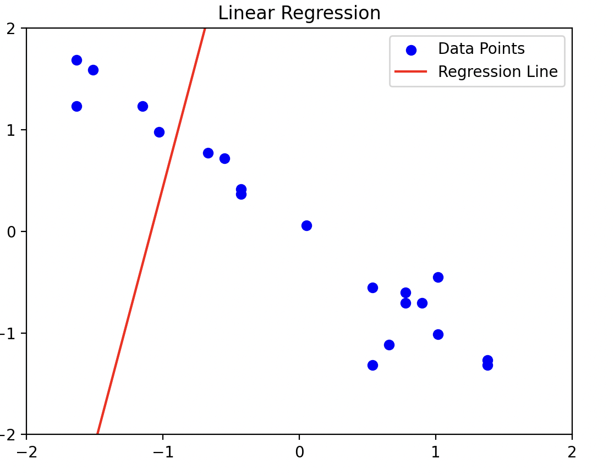
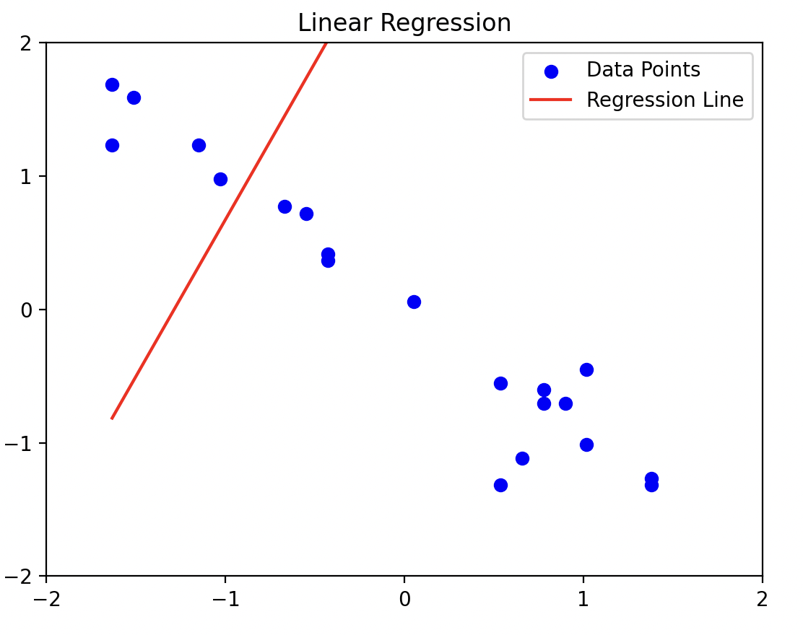
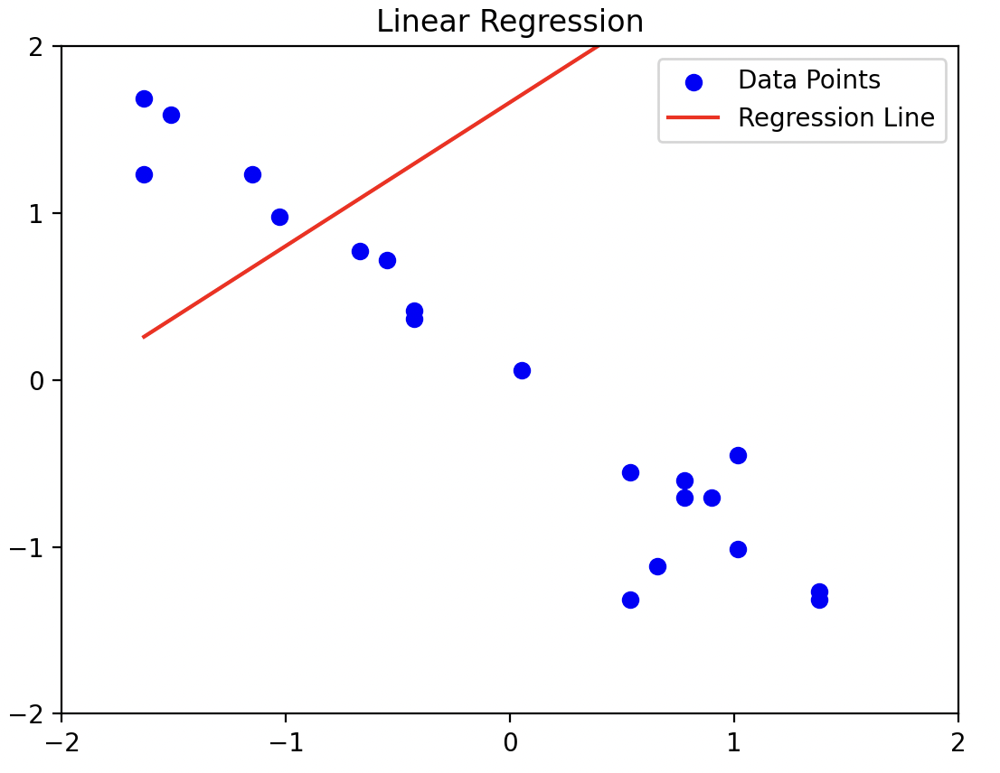
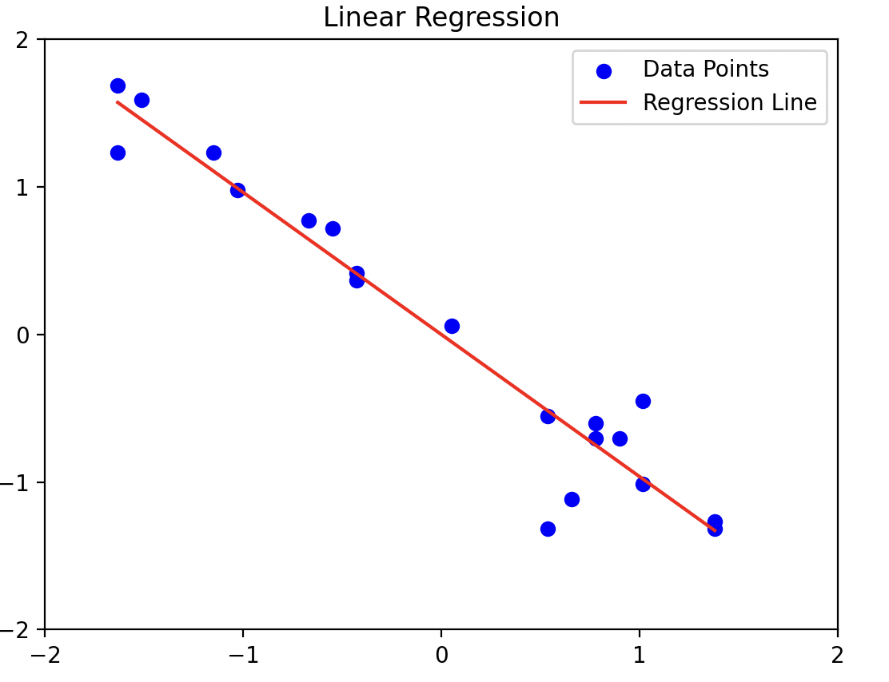
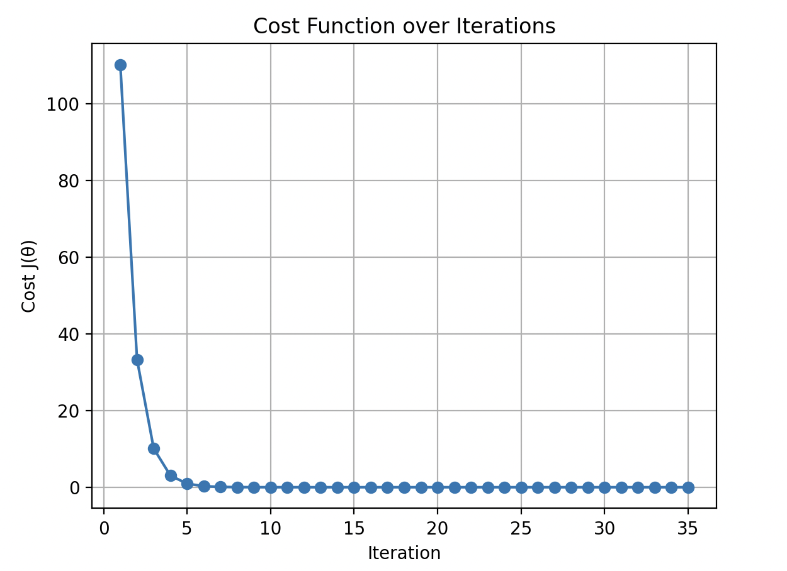

# A.I. Linear regression 

## Least Square 

## Linear regression with Gradient Descent

We define the hypothesis function as
$$
h_\theta(x_i) = \theta_0 + \theta_1 x_i, \quad i = 1, \dots, m
$$
where $m$ is the numbers of training samples.

We choose the **Mean Squared Error ** as the cost function:
$$
J(\theta_0, \theta_1) = \frac{1}{2m} \sum_{i=1}^{m} (h_\theta(x_i) - y_i)^2
$$
**Reason**
MSE is smooth and differentiable, allowing gradient-based optimization and it measures the average squared difference between predicted and true values, and the square term penalizes large errors more strongly, helping the algorithm converge more stably.

**Paritial Derivative**

Partial derivative with respect to $\theta_0$:
$$
\begin{aligned}
\frac{\partial J}{\partial \theta_0}
&= \frac{1}{2m} \sum_{i=1}^{m} 2 (h_\theta(x_i) - y_i) \frac{\partial h_\theta(x_i)}{\partial \theta_0} \\
&= \frac{1}{m} \sum_{i=1}^{m} (h_\theta(x_i) - y_i)
\end{aligned}
$$
Partial derivative with respect to $\theta_1$:
$$
\begin{aligned}
\frac{\partial J}{\partial \theta_1}
&= \frac{1}{2m} \sum_{i=1}^{m} 2 (h_\theta(x_i) - y_i) \frac{\partial h_\theta(x_i)}{\partial \theta_1} \\
&= \frac{1}{m} \sum_{i=1}^{m} (h_\theta(x_i) - y_i) x_i
\end{aligned}
$$
The gradient descent update rules are given by:
$$
\theta_0 \leftarrow \theta_0 - \alpha \cdot \frac{1}{m}\sum_{i=1}^{m}(h_\theta(x_i)-y_i)
$$

$$
\theta_1 \leftarrow \theta_1 - \alpha \cdot \frac{1}{m}\sum_{i=1}^{m}(h_\theta(x_i)-y_i)x_i
$$

We started with $(\theta_0, \theta_1) = (10, 10)$ and a learning rate of 0.9; after the first**, **second, and third iterations, the parameters were updated to $(5.5, 5.07)$, $(3.03, 2.35)$, and $(1.66, 0.86)$ respectively, and finally converged to about $(0, -0.96)$.

Here are the regression lines after the first, second, and third iterations, as well as the final converged line:

Here is the picture for the cost:

## A.II. Poly regression 

